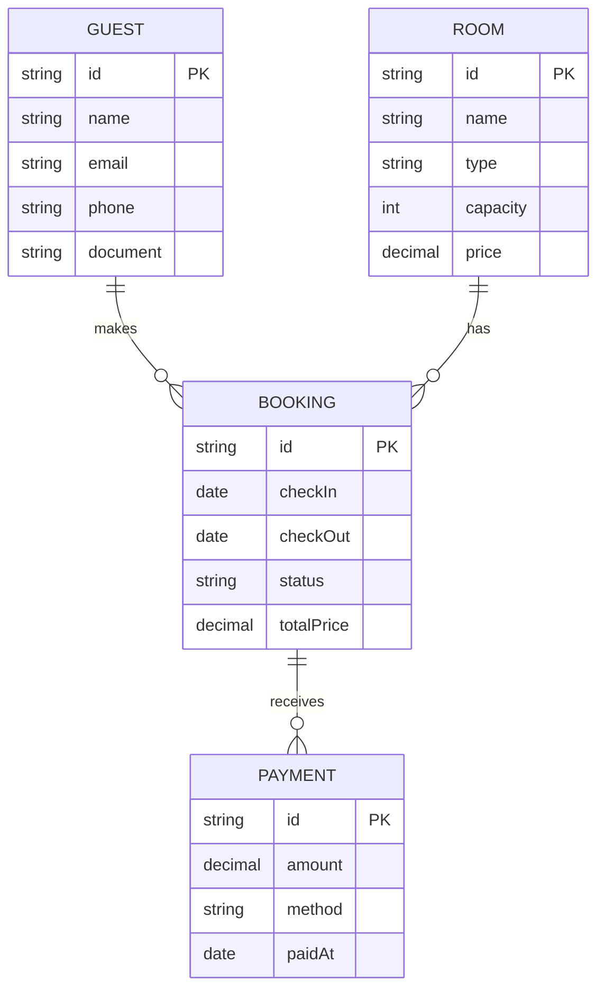

# Arquitetura do Sistema

## Visão Geral

O Pousada Management segue uma arquitetura **monolítica modular** baseada no Next.js App Router, com separação clara entre camadas e organização por features.

## Padrões Arquiteturais

### 1. Feature-Based Architecture

O código está organizado por domínio de negócio em `src/features/`:

```
src/features/
├── auth/           # Autenticação e autorização
├── bookings/       # Gestão de reservas
├── guests/         # Gestão de hóspedes
├── rooms/          # Gestão de quartos
├── financial/      # Módulo financeiro
├── quotes/         # Cotações e orçamentos
├── stock/          # Controle de estoque
└── projects/       # Gerenciamento de projetos
```

Cada feature contém:

- `actions/` - Server Actions
- `components/` - Componentes React específicos
- `hooks/` - Custom hooks
- `types/` - Tipos TypeScript
- `utils/` - Funções utilitárias

### 2. App Router (Next.js 15)

Rotas organizadas com Route Groups:

```
src/app/
├── (admin)/        # Área administrativa (protegida)
│   ├── bookings/
│   ├── guests/
│   ├── rooms/
│   ├── financial/
│   ├── dashboard/
│   └── tasks/
├── (public)/       # Área pública
│   └── forms/
└── api/            # API Routes
    └── v1/
```

### 3. Server-First Architecture

- **Server Components** por padrão
- **Server Actions** para mutações
- **Client Components** apenas quando necessário (interatividade)

## Camadas da Aplicação

```
┌─────────────────────────────────────────────────────────────┐
│                    Presentation Layer                        │
│  ┌─────────────────────────────────────────────────────────┐│
│  │  Pages (app/)  │  Components (components/)  │  Layouts  ││
│  └─────────────────────────────────────────────────────────┘│
├─────────────────────────────────────────────────────────────┤
│                     Business Layer                           │
│  ┌─────────────────────────────────────────────────────────┐│
│  │  Server Actions  │  Features  │  Hooks  │  Utils        ││
│  └─────────────────────────────────────────────────────────┘│
├─────────────────────────────────────────────────────────────┤
│                      Data Layer                              │
│  ┌─────────────────────────────────────────────────────────┐│
│  │  Prisma Client  │  Models  │  Migrations  │  Queries    ││
│  └─────────────────────────────────────────────────────────┘│
├─────────────────────────────────────────────────────────────┤
│                   Infrastructure Layer                       │
│  ┌─────────────────────────────────────────────────────────┐│
│  │  PostgreSQL  │  Cloud Storage  │  Auth Provider         ││
│  └─────────────────────────────────────────────────────────┘│
└─────────────────────────────────────────────────────────────┘
```

## Modelo de Dados

### Entidades Principais



### Prisma Schema

O schema está em `prisma/schema.prisma` e define:

- Modelos de dados com relacionamentos
- Enums para status e tipos
- Índices para performance
- Campos de auditoria (createdAt, updatedAt)

## Componentes de UI

### Design System

Baseado em **shadcn/ui** com Radix primitives:

```
src/components/
├── ui/             # Componentes base (Button, Input, Dialog...)
├── layout/         # Header, Sidebar, PageContainer
├── booking/        # Componentes de reserva
├── landing/        # Componentes de landing page
└── theme-customizer/  # Customização de tema
```

### Padrões de Componentes

- **Composition Pattern** para componentes complexos
- **Controlled/Uncontrolled** para formulários
- **Render Props** quando necessário flexibilidade

## Fluxo de Dados

### Leitura (Query)

```
Page (Server Component)
    ↓
Prisma Query (Server)
    ↓
React Server Component
    ↓
HTML (streaming)
```

### Escrita (Mutation)

```
Client Component (form)
    ↓
Server Action
    ↓
Prisma Mutation
    ↓
Revalidate Cache
    ↓
Updated UI
```

## Segurança

- **Autenticação**: Better Auth / Auth.js com sessões
- **Autorização**: Middleware para rotas protegidas
- **CSRF**: Tokens automáticos em Server Actions
- **SQL Injection**: Prevenido pelo Prisma

## Dependências Externas

| Serviço                | Uso                      |
| ---------------------- | ------------------------ |
| PostgreSQL (Cloud SQL) | Banco de dados principal |
| Vercel/Railway         | Hospedagem e deploy      |
| SendGrid/Resend        | Envio de emails          |

## Diretórios Principais

| Diretório         | Arquivos | Descrição           |
| ----------------- | -------- | ------------------- |
| `src/app/`        | ~150+    | Rotas e páginas     |
| `src/components/` | ~80+     | Componentes React   |
| `src/features/`   | ~60+     | Lógica de negócio   |
| `src/lib/`        | ~20+     | Utilitários core    |
| `prisma/`         | ~10+     | Schema e migrations |

## Recursos Relacionados

- [Project Overview](./project-overview.md)
- [Development Workflow](./development-workflow.md)
- [Security](./security.md)
